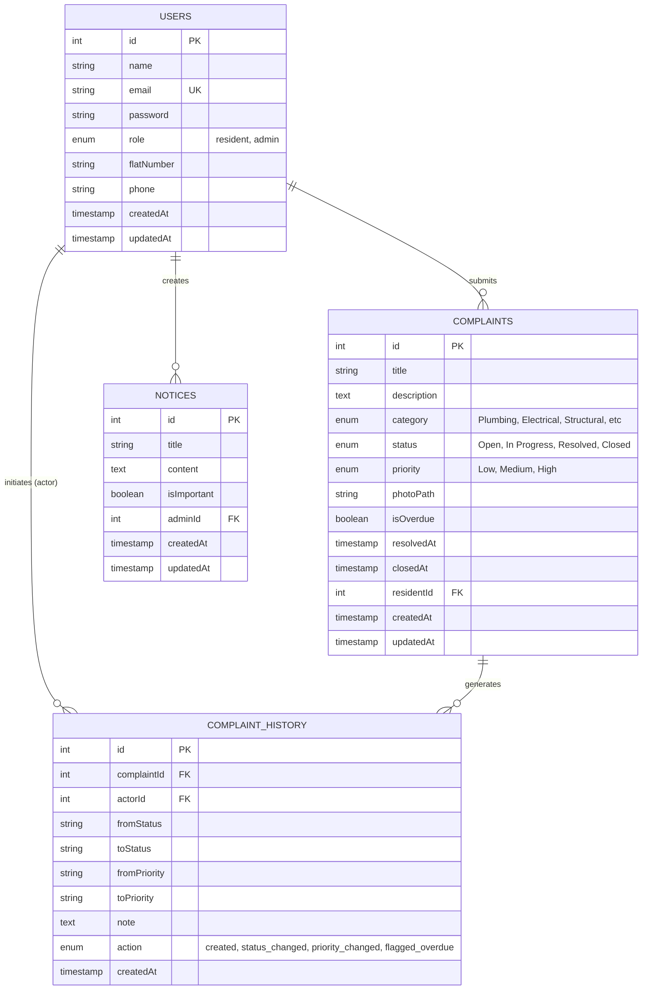

# 🏢 Society Maintenance Tracker

A full-stack platform for apartment societies to manage maintenance complaints, track their full history, post notices, and keep residents informed via email.

---

## 🚀 Quick Start

### Prerequisites
- Node.js ≥ 18
- npm ≥ 9

### 1. Clone & Install
```bash
git clone <repo-url>
cd society-maintenance-tracker
cd backend && npm install
cd ../frontend && npm install
```

### 2. Configure Backend Environment
```bash
cp backend/.env.example backend/.env
```

Open `backend/.env` and set your values.
- `JWT_SECRET`: any strong secret used to sign authentication tokens
- `JWT_EXPIRES_IN`: token expiration, e.g. `7d`
- `FRONTEND_URL`: frontend site URL for CORS, usually `http://localhost:3000`
- `EMAIL_HOST`: SMTP server host, e.g. `smtp.gmail.com`
- `EMAIL_PORT`: SMTP port, usually `587`
- `EMAIL_SECURE`: `true` for TLS, `false` for STARTTLS
- `EMAIL_USER` / `EMAIL_PASS`: SMTP credentials for sending emails
- `EMAIL_FROM`: sender display name and address, e.g. `"Society Maintenance <noreply@society.com>"`
- `OVERDUE_THRESHOLD_DAYS`: number of days before open complaints are considered overdue (default `7`)

> If `EMAIL_USER` and `EMAIL_PASS` are empty, the app uses Ethereal email preview and logs preview URLs to the console.

### 3. Default Admin Account
The backend creates a default admin user automatically on first startup if no admin exists:

| Field    | Value                  |
|----------|------------------------|
| Email    | admin@society.com      |
| Password | admin123               |

> Important: change the default admin password after first login.

### 4. Run (Development)

**Backend** (runs on port 5000):
```bash
cd backend
npm run dev
```

**Frontend** (runs on port 3000):
```bash
cd frontend
npm start
```

### Default Admin Account
| Field    | Value                  |
|----------|------------------------|
| Email    | admin@society.com      |
| Password | admin123               |

> Created automatically on first startup if no admin exists.

---

## 📁 Project Structure

```
society-maintenance-tracker/
├── backend/
│   ├── src/
|   |   ├── config/            # Env Configuration
│   │   ├── controllers/       # Route handlers
│   │   ├── middleware/        # Auth, file upload
│   │   ├── models/            # Sequelize models
│   │   ├── routes/            # Express routers
│   │   ├── services/          # Email service
│   │   └── index.js           # App entry point
│   ├── uploads/               # Uploaded complaint photos
│   ├── .env.example
│   └── package.json
└── frontend/
    ├── src/
    │   ├── components/        # Layout
    │   ├── context/           # Auth context
    │   ├── pages/             # Login, Register, Dashboards, NoticeBoard
    │   ├── utils/             # API client
    │   └── index.css          # Global styles
    └── package.json
```

---

## 🗄️ Database Schema

Uses **SQLite** via Sequelize (zero-config for development). In production, swap for PostgreSQL by updating the Sequelize dialect and connection string.

### Entity Relationship Diagram



**Key Relationships:**
- **Users → Complaints**: One resident can submit many complaints (1:M via `residentId`)
- **Complaints → ComplaintHistory**: One complaint generates many history records (1:M)
- **Users → ComplaintHistory**: One user can perform many actions on complaints (1:M via `actorId`)
- **Users → Notices**: One admin can create many notices (1:M via `adminId`)

---

### Users
| Column     | Type    | Notes                      |
|------------|---------|----------------------------|
| id         | INTEGER | PK, autoincrement          |
| name       | STRING  |                            |
| email      | STRING  | Unique                     |
| password   | STRING  | bcrypt hashed              |
| role       | ENUM    | `resident` \| `admin`      |
| flatNumber | STRING  | Optional                   |
| phone      | STRING  | Optional                   |
| createdAt  | DATE    |                            |
| updatedAt  | DATE    |                            |

### Complaints
| Column      | Type    | Notes                                               |
|-------------|---------|-----------------------------------------------------|
| id          | INTEGER | PK                                                  |
| title       | STRING  |                                                     |
| description | TEXT    |                                                     |
| category    | ENUM    | Plumbing, Electrical, Structural, Cleaning, Security, Lift, Parking, Other |
| status      | ENUM    | `Open` → `In Progress` → `Resolved`                |
| priority    | ENUM    | `Low` \| `Medium` \| `High`                         |
| photoPath   | STRING  | Relative URL to uploaded image                      |
| isOverdue   | BOOLEAN | Set by admin via flag-overdue endpoint              |
| resolvedAt  | DATE    | Timestamp when marked Resolved                      |
| residentId  | INTEGER | FK → Users                                          |

### ComplaintHistory
| Column       | Type   | Notes                                        |
|--------------|--------|----------------------------------------------|
| id           | INTEGER| PK                                           |
| complaintId  | INTEGER| FK → Complaints                              |
| actorId      | INTEGER| FK → Users (who made the change)             |
| fromStatus   | STRING |                                              |
| toStatus     | STRING |                                              |
| fromPriority | STRING |                                              |
| toPriority   | STRING |                                              |
| note         | TEXT   | Optional admin note                          |
| action       | ENUM   | `created` \| `status_changed` \| `priority_changed` \| `flagged_overdue` |
| createdAt    | DATE   | Immutable timestamp of the change            |

> Note: complaint metadata like title and description are not edited after submission in this implementation. The history table records only creation, status changes, priority changes, and overdue flags.

### Notices
| Column      | Type    | Notes                                    |
|-------------|---------|------------------------------------------|
| id          | INTEGER | PK                                       |
| title       | STRING  |                                          |
| content     | TEXT    |                                          |
| isImportant | BOOLEAN | Pinned to top; triggers email to all residents |
| adminId     | INTEGER | FK → Users                               |

---

## 🔌 API Documentation

Base URL: `http://localhost:5000/api`

All protected routes require: `Authorization: Bearer <token>`

### Auth

#### POST /auth/register
Register a new resident.
```json
// Body
{ "name": "Jane Doe", "email": "jane@example.com", "password": "secret123", "flatNumber": "A-404", "phone": "9876543210" }

// Response 201
{ "user": { ... }, "token": "eyJ..." }
```

#### POST /auth/login
```json
// Body
{ "email": "jane@example.com", "password": "secret123" }

// Response 200
{ "user": { ... }, "token": "eyJ..." }
```

#### GET /auth/profile `[Auth]`
Returns the current user.

---

### Complaints

#### POST /complaints `[Auth: Resident]`
Create a complaint (multipart/form-data).
```
Fields: title, description, category, photo (optional file)
```

#### GET /complaints/my `[Auth: Resident]`
Get all complaints for the logged-in resident, with full status history.

#### GET /complaints `[Auth: Admin]`
Get all complaints with optional filters.
```
Query params: category, status, priority, isOverdue (true), from (ISO date), to (ISO date), page, limit
```

#### GET /complaints/dashboard `[Auth: Admin]`
```json
// Response
{
  "total": 42,
  "overdueCount": 5,
  "byStatus": [{ "status": "Open", "count": "12" }, ...],
  "byCategory": [{ "category": "Plumbing", "count": "8" }, ...]
}
```

#### POST /complaints/flag-overdue `[Auth: Admin]`
Scans all open/in-progress complaints older than `OVERDUE_THRESHOLD_DAYS` and marks them overdue.
```json
// Response
{ "flagged": 3, "message": "3 complaint(s) flagged as overdue" }
```

#### PATCH /complaints/:id/status `[Auth: Admin]`
```json
// Body
{ "status": "In Progress", "note": "Plumber scheduled for tomorrow" }
```

#### PATCH /complaints/:id/priority `[Auth: Admin]`
```json
// Body
{ "priority": "High", "note": "Escalated due to water damage risk" }
```

---

### Notices

#### GET /notices `[Auth]`
Returns all notices, important ones sorted first.

#### POST /notices `[Auth: Admin]`
```json
// Body
{ "title": "Water Shutdown", "content": "No water on Sunday 8–10am", "isImportant": true }
```
If `isImportant` is true, emails all registered residents.

#### DELETE /notices/:id `[Auth: Admin]`

---

## 📧 Email Setup

### Option 1 — Gmail (recommended for production)
1. Enable 2FA on your Google account
2. Create an App Password: Google Account → Security → App Passwords
3. Set `EMAIL_USER` and `EMAIL_PASS` in `.env`

### Option 2 — Ethereal (testing only)
Leave `EMAIL_USER` and `EMAIL_PASS` blank. Emails will be logged to console with a `[EMAIL MOCK]` prefix but not actually sent.

---

## 🔒 Security Notes
- Passwords are bcrypt-hashed (salt rounds: 10)
- JWT tokens expire in 7 days (configurable)
- Role-based access control on every admin endpoint
- File uploads restricted to images ≤ 5MB
- Resolved complaints are immutable (cannot be re-opened)
